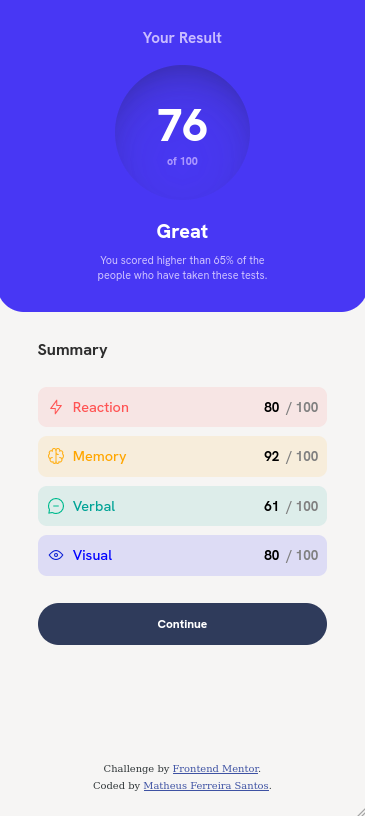
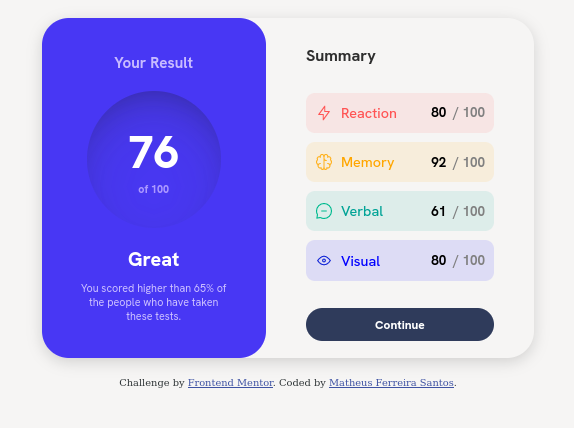

## Results summary component

Hello guys, in this repository I will present my solution for the design proposal of the component "Results summary component".

###
##### 🖌️ - Design Techniques

Basically, this solution had "nothing new", I did what is basic for every front-end programmer and I only used flex-box (even knowing that the display grid could be used combined with the flex-box, however, no saw no prior need for this).

##
##### 🤔 - Some problems

Because it was my first challenge on the mentor frontend, I had a little doubts when trying to find myself, within their directory architecture, that is, you will notice that, for example, the background colors may be minimally different, and that was because due to my unfamiliarity with the platform, however, I believe that in the next challenges I will be fully used to making the templates exactly identical to what will be proposed by the designer.

##
##### ❓ - How can i test your component?

It is possible to find the system running by the endpoint (on GitHub Pages): [Click here](https://matheus-fsantos.github.io/frontend-mentor-challenges/results-summary-component/src/);

##
##### ✅ - My Solution

Below, prints of my solution, and what was proposed

What was proposed:
###

###
My solution:
###

##### 👋 - Final Considerations

Anyway, that's it, I hope you like it, it took me about 1 hour to do, a relatively long time, I believe I can improve this time, however, I'm satisfied with the final result, any tip and help is welcome, and that's it, even more guys!

> by Matheus Ferreira Santos (August 31, 2023).
